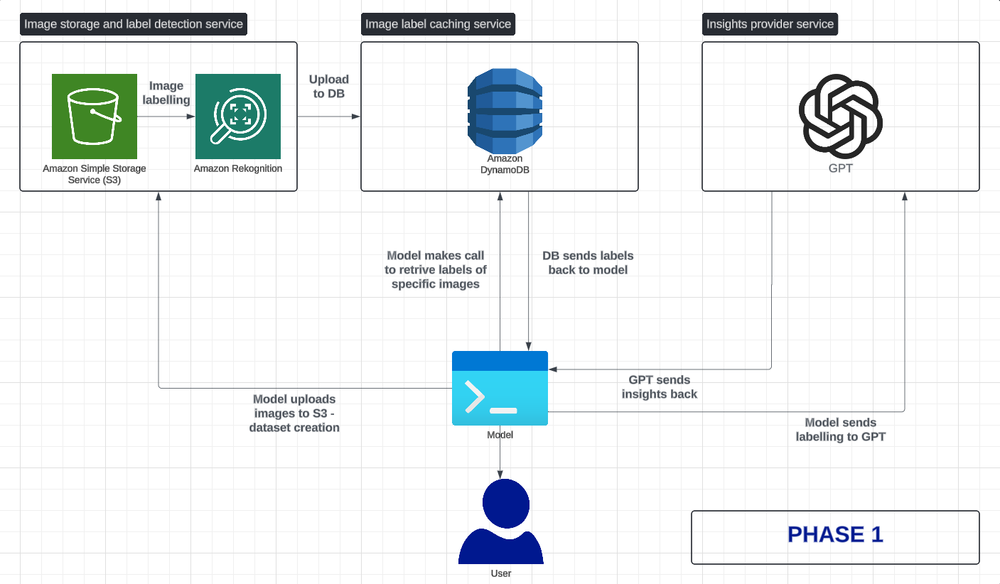

# Phase 1 architecture

### Objective for phase 1: make sure we get some form of correct output for each tool we're using

Below is the application architecture for phase 1, you can visit the public lucid chart URL [HERE](https://lucid.app/lucidchart/0c23461d-4a12-4536-8ea7-abcecfd7a402/view).

The generic logic flow is as follows:

1. Model uploads small dataset of images to S3
2. Rekognition processes these images in the S3 bucket and labels each one
3. Each image's S3 URL & labelling informaiton is uploaded to DynamoDB as {key : value} pairs.
4. Before model is ready to make its call to GPT, it requests specific images' labels from DynamoDB
5. These labels are sent to GPT for processing, i.e. GPT makes a recommendation on what clothes go well together
6. GPT sends insights back to Model to display on terminal

### Technologies used & their engineering justification

We used a bunch of different tools for phase 1 - **AWS S3**, **AWS Rekognition**, **AWS DynamoDB** and **OpenAI GPT**

- **AWS S3**: We need a cheap, secure and scalable tool to store our dataset's images.
  
- **AWS Rekognition**: While we could have trained our own model to accurately detail labelling info of images, it would be an expensive and time consuming process. Rekognition is pretty good at image labelling and offers 5000 free images per month in its free tier, so it fits our use case. Rekognition has awesome competitors in the image labelling space but their products could not compete with Rekognition's 5000 free images per month offering, _Welp!_ we're broke students.
  
- **AWS DynamoDB**: Our use case for DynamoDB is very simple, just `key:value` pairs of an image's S3 URL & it's labelling info from Rekognition. Due to our heavy reliance on the other AWS products above (S3 & Rekognition), having our database integrated in AWS' awesome ecosystem just makes things so much easier for us. We only have to manage 1 AWS account for most of the storage & vision analysis processing. (_Yay!_) 
  
- **OpenAI GPT**: Now, you may be asking - bozos, why couldn't you just upload images to GPT4o, it does it now! Well we _could_, but it's pretty expensive to upload and analyse images with GPT (relatively speaking). With GPT, we just send it images' labelling info (which is plain text) and it will send back it's gigabrain insights. _BUUUTT_ what about AWS Bedrock? or Google Gemini? or Meta AI? _Sigh_, so many options. To be honest, we're still in Phase 1 of this project, we might pivot to another LLM for insights or train one ourselves after reflecting and analysing how each phase went! _Oooh_ AND, we were stuck whether or not to pick GPT or AWS Bedrock for insights provision, but this Medium article [here](https://medium.com/version-1/aws-bedrocks-claude-2-100k-vs-azure-openai-s-gpt-4-32k-a-comparative-analysis-96e3eb9fd05a) pretty much sealed the deal on that - GPT is better than Bedrock right now for dataset analysis. Again, our choice of LLM could change in Phase 2 and onwards.

**TODOs:** 
- [x] Write intro to project in `README.md` 
- [ ] A small dataset should be uploaded to S3 
- [ ] Rekognition should automatically process these new images
- [ ] Rekognition should return labels for each image
- [ ] Image data stored in DynamoDB, with key = image's S3 URL and value = image's labels
- [ ] Send multiple image's label info to GPT and get some form of insight back
- [ ] Display insights on terminal
- [ ] Video demo to be published on `README.md`
- [ ] Application deployed on website  
