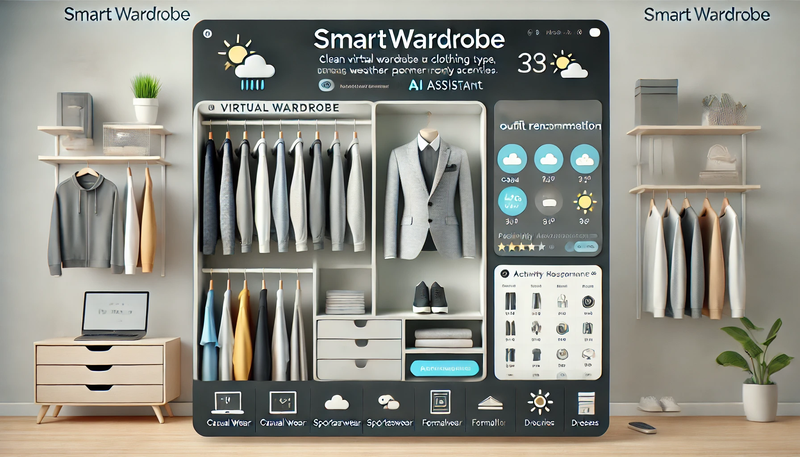

# SmartWardrobe

## SmartWardrobe: Your Personal AI Outfit Assistant
Welcome to SmartWardrobe! This application is designed to help users decide what outfit to wear based on their current inventory of clothes, the weather conditions and their daily routine. SmartWardrobe leverages the power of machine learning to understand users' wardrobes, analyze clothing colors, and determine the suitability of clothes for different weather conditions, ensuring you are always dressed appropriately for the weather and your activities. Whether you're heading to a business meeting, hitting the gym, or enjoying a casual day out, SmartWardrobe has got you covered.

## Key Features
 **Personalized Outfit Recommendations:** Get outfit suggestions tailored to your unique style and wardrobe.

 **Weather-Aware:** SmartWardrobe considers the current weather to suggest appropriate attire.

  **Activity-Based Suggestions:** Receive recommendations based on your daily schedule and activities.

  **Style and Practicality:** Balances fashion sense with functionality to ensure you look good and feel comfortable.

 **Machine Learning Insights:** Utilizes advanced algorithms to learn your clothing preferences and improve over time.

## How It Works
**Wardrobe Analysis:** Upload your wardrobe to SmartWardrobe. Our machine learning models will analyze your clothes, understanding their colors and styles.

**Weather Integration:** Sync with real-time weather data to get accurate recommendations based on current conditions.

**Activity Planning:** Input your daily routine, and SmartWardrobe will suggest outfits suitable for each activity.

**Continuous Learning:** The more you use SmartWardrobe, the better it gets at understanding your preferences and suggesting outfits that match your style and needs.

## Architecture
For the project's system design/architecture, please check out [`ARCHITECTURE.MD`](https://github.com/Arunteja27/outfit-recommender/blob/dev/v1/ARCHITECTURE.md)

## Contact
For any questions or feedback, please contact us at aruntejavk@gmail.com or anirudhmahesh13@gmail.com 

Thank you for checking out SmartWardrobe! We hope this project makes your daily outfit decisions easier and more enjoyable. Happy styling!

